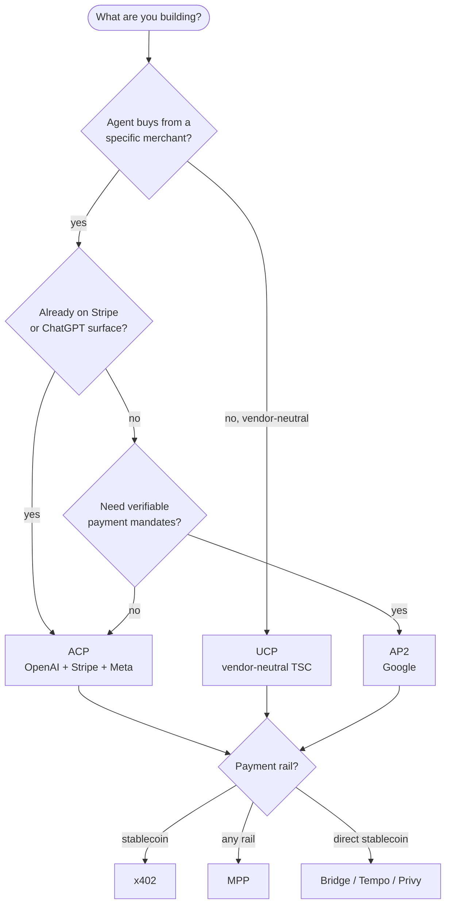

# Awesome Agentic Commerce [](https://awesome.re)

> Curated against real merchants and real schemas. Entries are rejected for fictitious well-known URIs, stale specs, unreachable endpoints, or unverifiable adoption claims.


[](https://github.com/xpaysh/awesome-agentic-commerce)
[](./UPDATES.md)
[](LICENSE)

This list covers the layer where AI agents (ChatGPT, Claude, Gemini, custom) discover, negotiate, and transact with merchant storefronts. The active protocols (ACP, UCP, AP2, TACP), the payment rails beneath (MPP, x402, cards, stablecoins), and the per-platform integrations that tie them together.

The broader 4-layer agentic-economy view (identity, discovery, communication, commerce) lives in [`agentic-economy.md`](./agentic-economy.md). The previous repo at `xpaysh/awesome-agentic-economy` 302-redirects here.

> **Latest** (2026-06-24): list restructured. Repo renamed from `awesome-agentic-economy`. New Glossary, Compatibility matrix, Editorial stance, anti-patterns, version pinning. Full notes: [`updates/2026-06-24.md`](./updates/2026-06-24.md). Weekly log: [`UPDATES.md`](./UPDATES.md).

**Last reviewed:** 2026-06-24. Next quarterly verification batch: 2026-Q3.

## Editorial stance

If you're picking one protocol to implement, this is the short version. Long form lives in [`protocols/commerce.md`](./protocols/commerce.md) and the [comparison page](https://docs.xpay.sh/agentic-commerce-protocols/comparison).

- **Already on Stripe or shipping into ChatGPT?** → **ACP**. The `delegate_payment` flow is the surface that justifies the protocol; without it ACP is a cart API in disguise.
- **Need to stay rail-flexible and vendor-neutral?** → **UCP**. Pay the RFC 9421 signature cost up front; that's what makes the protocol agent-safe.
- **Mandate-heavy or audit-sensitive flow?** → **AP2**. Verifiable Credentials are the entire authorization argument; if you're skipping VC verification, pick a different protocol.
- **True micropayments (sub-cent to single-digit USD)?** → **x402** as the rail under any of the above.
- **All four are draft or recently released.** Pin the spec date you vendor against (see [Version pinning](#version-pinning-spec-dates-this-list-assumes)) and expect minor shape changes for at least the next two quarters.

## Contents

- [Glossary](#glossary)
- [Pick a protocol](#pick-a-protocol)
- [Protocol comparison](#protocol-comparison)
- [Compatibility matrix](#compatibility-matrix-platform--protocol--rail)
- [Per-platform plugins](#per-platform-plugins)
- [Reference implementations and SDKs](#reference-implementations-and-sdks)
- [Maintainer's npm packages](#maintainers-npm-packages) (in [`xpaysh-packages.md`](./xpaysh-packages.md))
- [Payment rails](#payment-rails)
- [Discovery standards](#discovery-standards)
- [Files to **not** emit](#files-to-not-emit)
- [Conformance and tooling](#conformance-and-tooling)
- [Version pinning (spec dates this list assumes)](#version-pinning-spec-dates-this-list-assumes)
- [Working examples](#working-examples)
- [Weekly updates](#weekly-updates)
- [Related lists](#related-lists)
- [Contributing](#contributing)

---

## Glossary

Acronym collisions in this space are real. Disambiguated here so the rest of the list can be terse.

| Term | Stands for | Project | Layer |
|---|---|---|---|
| **ACP** (in this list) | Agentic Commerce Protocol | OpenAI · Stripe · Meta | Commerce |
| **IBM ACP** | Agent Communication Protocol | IBM | Agent-to-agent transport |
| **UCP** | Universal Commerce Protocol | Vendor-neutral TSC | Commerce |
| **AP2** | Agent Payments Protocol | Google | Commerce / mandates |
| **TACP** | Trusted Agentic Commerce Protocol | Forter | Trust-signal overlay |
| **Visa TAP** | Trusted Agent Protocol | Visa | Identity / verification |
| **MPP** | Machine Payments Protocol | Tempo + Stripe | Payment rail |
| **x402** | HTTP 402 Payment Required | Coinbase + Cloudflare | Payment rail |
| **A2A** | Agent-to-Agent Protocol | Google | Communication |
| **MCP** | Model Context Protocol | Anthropic | Agent-to-tool |

"ACP" without qualifier in this list always means the commerce protocol. "TACP" (Forter) and "TAP" (Visa) are different projects despite the near-collision; both are listed under their full names.

---

## Pick a protocol

Five-second decision aid. Branches are not exclusive: real implementations often run two protocols side by side.



Long form: [`protocols/commerce.md`](./protocols/commerce.md).

---

## Protocol comparison

> **Status warning.** UCP and AP2 are still draft. ACP cuts dated releases. Field names, required arrays, and authentication semantics for the draft protocols can change between minor versions. Pin to a date and rebuild quarterly.

| Protocol | Spec repo | Sponsor | Surface | Discovery | Payment auth | Signed requests |
|---|---|---|---|---|---|---|
| **ACP** — Agentic Commerce Protocol | [agentic-commerce-protocol/agentic-commerce-protocol](https://github.com/agentic-commerce-protocol/agentic-commerce-protocol) | OpenAI · Stripe · Meta (TSC, [governance](https://github.com/agentic-commerce-protocol/agentic-commerce-protocol/blob/main/docs/governance.md)) | Cart, checkout, delegated payment, discounts, fulfillment | partner-specific (no well-known) | `delegate_payment` flow | optional |
| **UCP** — Universal Commerce Protocol | [Universal-Commerce-Protocol/ucp](https://github.com/Universal-Commerce-Protocol/ucp) | Vendor-neutral Tech Council | Cart, checkout, order, catalog, refunds, disputes | `/.well-known/ucp` (business profile) | external (any rail) | RFC 9421 per spec |
| **AP2** — Agent Payments Protocol | [google-agentic-commerce/AP2](https://github.com/google-agentic-commerce/AP2) | Google | Signed mandates, A2A transport | A2A agent-card | verifiable credentials | yes (JWS) |
| **TACP** — Trusted Agentic Commerce | [forter/trusted-agentic-commerce-protocol](https://github.com/forter/trusted-agentic-commerce-protocol) | Forter | Parallel agent-trust overlay (orthogonal to cart/checkout) | JWKS endpoint (key publication only; no capability discovery) | n/a (signal layer) | JWS + JWE |

Side-by-side technical comparison: [docs.xpay.sh/agentic-commerce-protocols/comparison](https://docs.xpay.sh/agentic-commerce-protocols/comparison).

---

## Compatibility matrix (platform × protocol × rail)

What composes end to end. ✓ = covered by an entry in this list; — = no known implementation; *partial* = present but with caveats noted in the linked entry. License is the plugin's license; rail support varies by configuration.

**How to read this:** rows are sorted vendor-first. `xpaysh` rows are **reference implementations**, not production-hardened first-party paths. Where a vendor publishes an official ACP / UCP / AP2 path on their platform, it lands above the `xpaysh` row for that platform.

| Platform | ACP | UCP | AP2 | Rails supported | Maintainer | Type |
|---|:---:|:---:|:---:|---|---|---|
| WooCommerce | ✓ | ✓ | ✓ | x402, cards via PSP | xpaysh | reference impl |
| commercetools | ✓ | ✓ | ✓ | x402, cards | xpaysh | reference impl |
| BigCommerce | ✓ | ✓ | ✓ | x402, cards | xpaysh | reference impl |
| Magento / Adobe Commerce | ✓ | ✓ | ✓ | x402, cards | xpaysh | reference impl |
| Shopify | ✓ | ✓ | ✓ | x402, cards | xpaysh | reference impl |
| Salesforce B2C Commerce | ✓ | ✓ | ✓ | x402, cards | xpaysh | reference impl |
| Saleor | ✓ | ✓ | ✓ | x402, cards | xpaysh | reference impl |
| PrestaShop | ✓ | ✓ | ✓ | x402, cards | xpaysh | reference impl |

A `✓` in this table means an entry exists in [Per-platform plugins](#per-platform-plugins) that implements the protocol. It does not imply production-tested adoption at scale on that platform; check the linked repo for status. Vendor-internal work that isn't open-source isn't tracked here.

---

## Per-platform plugins

Repos for each row in the matrix above. Vendor-maintained entries marked *(official)*. Where no first-party public repo exists, the xpaysh reference is the only entry.

| Platform | Plugin | Protocols | Maintainer | Packaging |
|---|---|---|---|---|
| WooCommerce | [agentic-commerce-for-woocommerce](https://github.com/xpaysh/agentic-commerce-for-woocommerce) | ACP, UCP, AP2 | xpaysh | WordPress plugin (PHP) |
| commercetools | [agentic-commerce-for-commercetools](https://github.com/xpaysh/agentic-commerce-for-commercetools) | ACP, UCP, AP2 | xpaysh | TypeScript service, RFC 9421 middleware (env-gated) |
| BigCommerce | [agentic-commerce-for-bigcommerce](https://github.com/xpaysh/agentic-commerce-for-bigcommerce) | ACP, UCP, AP2 | xpaysh | BigCommerce App |
| Magento / Adobe Commerce | [agentic-commerce-for-magento](https://github.com/xpaysh/agentic-commerce-for-magento) | ACP, UCP, AP2 | xpaysh | Magento module |
| Shopify | [agentic-commerce-for-shopify-app](https://github.com/xpaysh/agentic-commerce-for-shopify-app) | ACP, UCP, AP2 | xpaysh | Shopify App; composes with Shopify's native UCP path |
| Salesforce B2C | [agentic-commerce-for-salesforce-commerce](https://github.com/xpaysh/agentic-commerce-for-salesforce-commerce) | ACP, UCP, AP2 | xpaysh | B2C Commerce cartridge + PWA Kit extension |
| Saleor | [agentic-commerce-for-saleor](https://github.com/xpaysh/agentic-commerce-for-saleor) | ACP, UCP, AP2 | xpaysh | Saleor app; composes with Saleor's MCP server |
| PrestaShop | [agentic-commerce-for-prestashop](https://github.com/xpaysh/agentic-commerce-for-prestashop) | ACP, UCP, AP2 | xpaysh | PrestaShop module |

> **Open call for first-party entries.** If you maintain an official ACP / UCP / AP2 path for any of the platforms above, open a PR adding it as the first row for that platform. Vendor entries always sort above third-party reference implementations.

Platforms without a current entry (OpenCart, Shopware, Spree, Sylius, nopCommerce, Drupal Commerce, Ecwid): walkthrough and starter kit in [`community/CONTRIBUTING.md`](./community/CONTRIBUTING.md). They are removed from this section until a real plugin lands.

---

## Reference implementations and SDKs

| Implementation | Type | Protocols | Language | Maintainer |
|---|---|---|---|---|
| [vercel/acp-handler](https://github.com/vercel/acp-handler) | Handler | ACP | TypeScript | Vercel *(official)* |
| [NVIDIA-AI-Blueprints/Retail-Agentic-Commerce](https://github.com/NVIDIA-AI-Blueprints/Retail-Agentic-Commerce) | Reference architecture | ACP, UCP | Python | NVIDIA *(official)* |
| [Universal-Commerce-Protocol/js-sdk](https://github.com/Universal-Commerce-Protocol/js-sdk) | SDK + RFC 9421 verifier | UCP | TypeScript | UCP TSC *(official)* |
| [Universal-Commerce-Protocol/python-sdk](https://github.com/Universal-Commerce-Protocol/python-sdk) | SDK | UCP | Python | UCP TSC *(official)* |
| [Universal-Commerce-Protocol/ucp-schema](https://github.com/Universal-Commerce-Protocol/ucp-schema) | Schema validator | UCP | Rust | UCP TSC *(official)* |
| [Universal-Commerce-Protocol/samples](https://github.com/Universal-Commerce-Protocol/samples) | Sample agents + merchants | UCP | mixed | UCP TSC *(official)* |
| [Universal-Commerce-Protocol/conformance](https://github.com/Universal-Commerce-Protocol/conformance) | Conformance suite | UCP | mixed | UCP TSC *(official)* |
| [xpaysh/agentic-commerce-plugin-template](https://github.com/xpaysh/agentic-commerce-plugin-template) | Monorepo template | ACP, UCP, AP2 | TypeScript | xpaysh |

## Maintainer's npm packages

The maintainer of this list ([xpay✦](https://www.xpay.sh)) publishes a framework-agnostic `@xpaysh/*` package family covering schema vendoring, RFC 9421 signatures, well-known generators, and conformance fixtures for ACP / UCP / AP2. Listed separately in [`xpaysh-packages.md`](./xpaysh-packages.md) so the main list stays neutral.

---

## Payment rails

These sit *below* the commerce protocols. Any commerce protocol can plug into any rail.

| Rail | Type | Settlement | Best fit | Spec |
|---|---|---|---|---|
| **Stripe MPP** | Machine Payments Protocol (payment-method agnostic) | varies by method | cards, stablecoin, fiat acceptance via standard PSP plumbing | [mpp.dev](https://mpp.dev) |
| **x402** | HTTP 402 native | stablecoin onchain, ~seconds | agent micropayments, low-friction stablecoin | [x402.org](https://x402.org) |
| **Cards (direct)** | PSP APIs | T+1+ | high-value consumer checkout, existing PSP relationship | Stripe / Adyen / Braintree / Checkout.com |
| **Stablecoin direct** | Onchain primitives | onchain | programmatic settlement without a payments protocol | Bridge / Tempo / Privy |

xpay✦ operates an x402 facilitator listed on [x402.org](https://x402.org): [facilitator.xpay.sh](https://www.xpay.sh/x402-facilitators/xpay/).

---

## Discovery standards

The well-known URIs and registries an agentic-commerce surface actually uses. Real, externally verifiable.

| Path / standard | Spec | Purpose |
|---|---|---|
| `/llms.txt` | [llmstxt.org](https://llmstxt.org) | Markdown, LLM-readable site map |
| `/.well-known/agent-card.json` | [a2a-protocol.org](https://a2a-protocol.org/) | A2A 1.0 agent card; the path is listed in [IANA's well-known URIs registry](https://www.iana.org/assignments/well-known-uris/well-known-uris.xhtml) |
| schema.org JSON-LD | [schema.org](https://schema.org) | `Product`, `Offer`, `AggregateOffer`, `BreadcrumbList` |
| `/robots.txt` | [RFC 9309](https://datatracker.ietf.org/doc/rfc9309/) | Allowlist/block: `GPTBot`, `ClaudeBot`, `Google-Extended`, `PerplexityBot`, `CCBot`, `Amazonbot` |
| `/.well-known/oauth-protected-resource` | [RFC 9728](https://datatracker.ietf.org/doc/rfc9728/) | Agent OAuth |
| `/.well-known/ucp` (no extension) | [UCP business profile](https://ucp.dev/latest/specification/overview/), [Google's UCP guide](https://developers.google.com/merchant/ucp/guides/ucp-profile) | UCP capability negotiation. On-the-wire `version` is a YYYY-MM-DD date. Status `draft` upstream. Fetched by Google per their UCP guide; adopter list maintained in the UCP business-profile spec. |

### Files to **not** emit

The negative space. Every entry below has been seen in plugin output or blog posts in 2025–2026 and is **not** in any active spec. If you see a published implementation emitting one, [open an issue](https://github.com/xpaysh/awesome-agentic-commerce/issues) and we'll list it here.

- `/.well-known/agentic-commerce.json`
- `/.well-known/ucp.json` (the real UCP profile path is `/.well-known/ucp`, no extension)
- `/.well-known/acp.json`
- `/.well-known/ap2.json`
- `/.well-known/mcp.json`
- `/.well-known/ai-plugin.json` (deprecated OpenAI GPT plugin manifest)
- `/agents.txt`
- `/ai.txt`

### Protocol-level anti-patterns

- **ACP without `delegate_payment`** is just a cart API. The delegated-payment flow is what distinguishes ACP from a generic checkout.
- **UCP without RFC 9421 signatures** ships a request shape that any server can serve but no agent can authenticate. The signature requirement is what makes the protocol agent-safe.
- **AP2 mandates without verifiable-credential verification** are decorative JSON. The VC step is the entire authorization argument.
- **Emitting both `/.well-known/ucp` and `/.well-known/ucp.json`** to "be safe" doubles your discovery surface, halves your cache hit rate, and signals to a careful reader that you copied from two different blog posts.
- **Vendoring schemas at HEAD instead of a dated release** breaks reproducibility. Pin to a release tag or a dated `spec/YYYY-MM-DD/` snapshot.

---

## Conformance and tooling

- [Universal-Commerce-Protocol/conformance](https://github.com/Universal-Commerce-Protocol/conformance) — official UCP conformance suite.
- [`@xpaysh/conformance-fixtures`](https://www.npmjs.com/package/@xpaysh/conformance-fixtures) — golden ACP + UCP request/response payloads cross-validating against canonical schemas via Ajv.
- [`@xpaysh/storefront-audit`](https://www.npmjs.com/package/@xpaysh/storefront-audit) — `ac-doctor` CLI; audits a live storefront for the discovery surface above.
- [`@xpaysh/lint-wellknowns`](https://www.npmjs.com/package/@xpaysh/lint-wellknowns) — CI linter; fails builds emitting the "files to not emit" list above.

---

## Version pinning (spec dates this list assumes)

This list assumes the following upstream versions. Entries that vendor schemas should match.

| Source | Pinned version | Stability |
|---|---|---|
| ACP | latest released `spec/YYYY-MM-DD/` | released |
| UCP | active draft (date-versioned, e.g. `2026-05-18`) | draft with active deployments |
| AP2 | `draft` | pre-stable, no released tag |
| TACP | as published | external (Forter) |

The npm packages in [`@xpaysh/*`](#xpaysh-packages-npm) declare their pinned versions in each package's README. Use those as the source of truth when integrating.

---

## Working examples

Each example is a "vending machine" agent — the smallest end-to-end agent-buys-from-merchant flow — implemented against a different protocol stack. Clone and run in under five minutes.

```bash
git clone https://github.com/xpaysh/agentic-economy-boilerplate
cd agentic-economy-boilerplate

cd acp-stripe-vending-machine && npm start   # OpenAI + Stripe checkout
cd x402-vending-machine && npm start         # stablecoin micropayments
cd ap2-vending-machine && npm start          # verifiable mandates
```

Long form: [`use-cases/README.md`](./use-cases/README.md), [`implementations/README.md`](./implementations/README.md).

---

## Weekly updates

[`UPDATES.md`](./UPDATES.md) — week-by-week ecosystem changelog. Newest first.

---

## Related lists

- [Awesome MCP Servers](https://github.com/punkpeye/awesome-mcp-servers) — sister ecosystem; many entries are MCP servers exposed by commerce platforms.
- [Awesome x402](https://github.com/xpaysh/awesome-x402) — x402-specific (the rail under several entries above).
- [Awesome AI Agents](https://github.com/e2b-dev/awesome-ai-agents) — general AI agent resources.
- [Awesome LLM Apps](https://github.com/Shubhamsaboo/awesome-llm-apps) — LLM application catalog.

---

## Contributing

This list aims for **signal over volume**. Every entry must earn its line.

**Acceptance criteria:**

1. **Real and reachable.** A working repo, a live endpoint, or a published package. No vapor, no "coming soon," no bare GitHub-org URLs.
2. **Speaks at least one of {ACP, UCP, AP2}** end to end, or is a payment rail / discovery standard / tooling repo the protocols depend on.
3. **One-sentence "why this matters"** must fit in the table cell. If we can't write that sentence, the entry doesn't go in.
4. **License declared** in the linked repo. Closed-source acceptable for hosted services if the API is public.
5. **Last commit within 12 months,** or the entry is tagged `legacy` and kept for reference only.
6. **Adoption claims must be linkable.** Transaction counts, partner counts, deployment claims need a primary-source link. Self-reported numbers without one get cut.

**Two ways in:**

- **Add an entry**: open a PR adding your repo to the relevant section. Full criteria in [`community/CONTRIBUTING.md`](./community/CONTRIBUTING.md).
- **Build a new per-platform plugin**: starter kit at [`xpaysh/agentic-commerce-plugin-template`](https://github.com/xpaysh/agentic-commerce-plugin-template). Bounty amounts and process: [`community/CONTRIBUTING.md`](./community/CONTRIBUTING.md).

Maintained by [xpay✦](https://www.xpay.sh).

---

## License

[CC0 1.0 Universal](https://creativecommons.org/publicdomain/zero/1.0/). Public domain dedication. Use freely.
