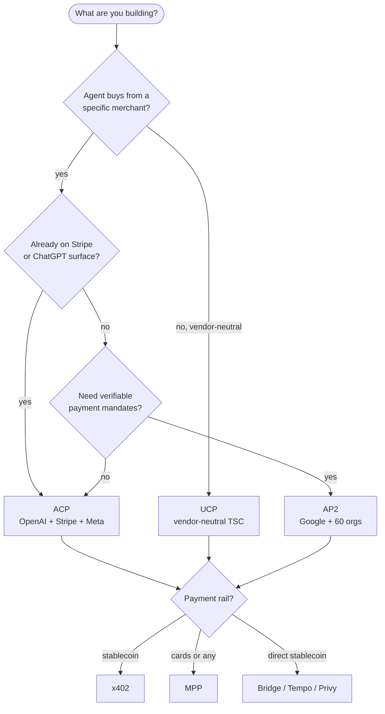

# Awesome Agentic Commerce [](https://awesome.re)

> A curated reference for builders implementing **agentic commerce protocols** against real merchants. Strict acceptance criteria, attribute-rich tables, anti-patterns, verified well-known URIs, working schemas. Not a wall of links.

[](https://github.com/xpaysh/awesome-agentic-commerce)
[](./UPDATES.md)
[](LICENSE)
[](./UPDATES.md)
[](https://github.com/xpaysh/agentic-economy-boilerplate)

This list covers the layer where AI agents (ChatGPT, Claude, Gemini, custom) discover, negotiate, and transact with merchant storefronts on behalf of human buyers. The active protocols (ACP, UCP, AP2), the discovery standards (`llms.txt`, A2A `agent-card`, schema.org), the payment rails beneath (MPP, x402, cards, stablecoins), and the per-platform integrations that tie them together.

Maintained by [xpay✦](https://www.xpay.sh). The broader agentic-economy view (identity, discovery, communication, commerce as a 4-layer stack) lives in [`agentic-economy.md`](./agentic-economy.md).

## Contents

- [Pick a protocol](#pick-a-protocol)
- [Protocol comparison](#protocol-comparison)
- [Per-platform plugins](#per-platform-plugins)
- [Reference implementations and SDKs](#reference-implementations-and-sdks)
- [`@xpaysh/*` packages (npm)](#xpaysh-packages-npm)
- [Payment rails](#payment-rails)
- [Discovery standards](#discovery-standards)
- [Files to **not** emit](#files-to-not-emit)
- [Conformance and tooling](#conformance-and-tooling)
- [Working examples](#working-examples)
- [Weekly updates](#weekly-updates)
- [Related lists](#related-lists)
- [Contributing](#contributing)

---

## Pick a protocol

Five-second decision aid. Branches are not exclusive: real implementations often run two protocols side by side.



If you're still unsure, the long form is in [`protocols/commerce.md`](./protocols/commerce.md).

---

## Protocol comparison

| Protocol | Spec repo | Sponsor | Surface | Discovery | Payment auth | Signed requests |
|---|---|---|---|---|---|---|
| **ACP** — Agentic Commerce Protocol | [agentic-commerce-protocol/agentic-commerce-protocol](https://github.com/agentic-commerce-protocol/agentic-commerce-protocol) | OpenAI · Stripe · Meta (TSC) | Cart, checkout, delegated payment, discounts, fulfillment | none defined in spec; partner-specific | `delegate_payment` flow | optional |
| **UCP** — Universal Commerce Protocol | [Universal-Commerce-Protocol/ucp](https://github.com/Universal-Commerce-Protocol/ucp) | Vendor-neutral Tech Council | Cart, checkout, order, catalog, refunds, disputes | `/.well-known/ucp` (business profile) | external (any rail) | RFC 9421 required |
| **AP2** — Agent Payments Protocol | [google-agentic-commerce/AP2](https://github.com/google-agentic-commerce/AP2) | Google | Signed mandates, A2A transport | A2A agent-card | verifiable credentials | yes (JWS) |
| **TACP** — Trusted Agentic Commerce | [forter/trusted-agentic-commerce-protocol](https://github.com/forter/trusted-agentic-commerce-protocol) | Forter | Parallel agent-trust overlay (orthogonal to cart/checkout) | JWKS | n/a (signal layer) | JWS + JWE |

Side-by-side technical comparison: [docs.xpay.sh/agentic-commerce-protocols/comparison](https://docs.xpay.sh/agentic-commerce-protocols/comparison).

---

## Per-platform plugins

Each row: protocols spoken, license, link. Vendor-maintained entries marked *(official)*; everything else is `xpaysh/` reference or community-contributed.

### WooCommerce
- [xpaysh/agentic-commerce-for-woocommerce](https://github.com/xpaysh/agentic-commerce-for-woocommerce) — v0.2.x, PHP, ACP + UCP + AP2, WordPress plugin, GPLv2.

### commercetools
- [xpaysh/agentic-commerce-for-commercetools](https://github.com/xpaysh/agentic-commerce-for-commercetools) — v0.2.1, TypeScript, ACP + UCP + AP2, RFC 9421 signature verification middleware on `/ucp/*` + `/acp/*` (env-gated).

### BigCommerce
- [xpaysh/agentic-commerce-for-bigcommerce](https://github.com/xpaysh/agentic-commerce-for-bigcommerce) — v0.2.1, ACP + UCP + AP2, BigCommerce App via App Marketplace.

### Magento / Adobe Commerce
- [xpaysh/agentic-commerce-for-magento](https://github.com/xpaysh/agentic-commerce-for-magento) — v0.2.1, ACP + UCP + AP2. Consolidates two unmaintained upstream ACP modules onto multi-protocol coverage.

### Shopify
- [Shopify](https://github.com/Shopify) *(official)* — Shopify's first-party UCP path; composes with the broader Shopify checkout.
- [xpaysh/agentic-commerce-for-shopify-app](https://github.com/xpaysh/agentic-commerce-for-shopify-app) — v0.2.1, ACP + UCP + AP2. Shopify App; composes with Shopify's UCP-native flow rather than competing.

### Salesforce Commerce Cloud / Demandware
- [xpaysh/agentic-commerce-for-salesforce-commerce](https://github.com/xpaysh/agentic-commerce-for-salesforce-commerce) — v0.2.1, ACP + UCP + AP2, B2C Commerce cartridge + PWA Kit extension.

### Saleor
- [saleor/saleor-mcp](https://github.com/saleor) *(official)* — Saleor's MCP server (MCP transport binding).
- [xpaysh/agentic-commerce-for-saleor](https://github.com/xpaysh/agentic-commerce-for-saleor) — v0.2.1, ACP + UCP + AP2 protocol layer; composes with `saleor-mcp`.

### PrestaShop
- [xpaysh/agentic-commerce-for-prestashop](https://github.com/xpaysh/agentic-commerce-for-prestashop) — v0.2.1, ACP + UCP + AP2, PrestaShop module.

### OpenCart, Shopware, Spree, Sylius, nopCommerce, Drupal Commerce, Ecwid
Template-based, community-contributed. Walkthrough in [`community/CONTRIBUTING.md`](./community/CONTRIBUTING.md), starter kit at [`xpaysh/agentic-commerce-plugin-template`](https://github.com/xpaysh/agentic-commerce-plugin-template).

---

## Reference implementations and SDKs

- [vercel/acp-handler](https://github.com/vercel/acp-handler) — generic Next.js handler for ACP. Platform-agnostic.
- [NVIDIA-AI-Blueprints/Retail-Agentic-Commerce](https://github.com/NVIDIA-AI-Blueprints/Retail-Agentic-Commerce) — NVIDIA blueprint covering ACP + UCP.
- [Universal-Commerce-Protocol/js-sdk](https://github.com/Universal-Commerce-Protocol/js-sdk) — official UCP TypeScript SDK with RFC 9421 verifier.
- [Universal-Commerce-Protocol/python-sdk](https://github.com/Universal-Commerce-Protocol/python-sdk) — official UCP Python SDK.
- [Universal-Commerce-Protocol/ucp-schema](https://github.com/Universal-Commerce-Protocol/ucp-schema) — Rust validator.
- [Universal-Commerce-Protocol/samples](https://github.com/Universal-Commerce-Protocol/samples) — sample agents and merchants.
- [xpaysh/agentic-commerce-plugin-template](https://github.com/xpaysh/agentic-commerce-plugin-template) — TypeScript monorepo template for new per-platform plugins.

## `@xpaysh/*` packages (npm)

Schema-vendored, framework-agnostic, deterministic. Every package is tested against the canonical upstream schemas; the test fixtures themselves are published as a package.

| Package | What it ships |
|---|---|
| [`@xpaysh/acp-schemas`](https://www.npmjs.com/package/@xpaysh/acp-schemas) | Real ACP JSON Schemas vendored from upstream `spec/2026-04-17`. 7 bundles, 140 type defs. |
| [`@xpaysh/ucp-schemas`](https://www.npmjs.com/package/@xpaysh/ucp-schemas) | 83 UCP schemas vendored from `Universal-Commerce-Protocol/ucp`. `generateUcpProfile()` + `registerForValidation(ajv)`. |
| [`@xpaysh/ap2-schemas`](https://www.npmjs.com/package/@xpaysh/ap2-schemas) | AP2 namespace (`SPEC_VERSION='draft'` while upstream is pre-stable). |
| [`@xpaysh/adapter-contract`](https://www.npmjs.com/package/@xpaysh/adapter-contract) | The `PlatformAdapter` TS interface every per-platform plugin implements. |
| [`@xpaysh/template-adapter`](https://www.npmjs.com/package/@xpaysh/template-adapter) | Working reference `PlatformAdapter` backed by a deterministic in-memory catalog. Copy as the starting point for a new plugin. |
| [`@xpaysh/discovery`](https://www.npmjs.com/package/@xpaysh/discovery) | Pure-function generators for `/llms.txt`, schema.org JSON-LD, `robots.txt`, A2A `agent-card.json`, RFC 9728. Zero deps. |
| [`@xpaysh/cart-deeplinks`](https://www.npmjs.com/package/@xpaysh/cart-deeplinks) | HS256-signed JWT cart-handoff URLs. |
| [`@xpaysh/storefront-audit`](https://www.npmjs.com/package/@xpaysh/storefront-audit) | Discovery-layer auditor + `ac-doctor` CLI; rejects fictitious well-known URIs. |
| [`@xpaysh/http-message-signatures`](https://www.npmjs.com/package/@xpaysh/http-message-signatures) | RFC 9421 sign/verify; ed25519 + hmac-sha256; targets the component set UCP REST uses. |
| [`@xpaysh/conformance-fixtures`](https://www.npmjs.com/package/@xpaysh/conformance-fixtures) | Golden ACP + UCP request/response payloads; every fixture cross-validates against the canonical schemas via Ajv. |
| [`@xpaysh/acp-session-store`](https://www.npmjs.com/package/@xpaysh/acp-session-store) | ACP checkout-session storage: InMemorySessionStore + DynamoDBSessionStore behind a single interface. |
| [`@xpaysh/lint-wellknowns`](https://www.npmjs.com/package/@xpaysh/lint-wellknowns) | CI linter + GitHub Action that fails builds emitting fictitious well-known URIs. |

---

## Payment rails

These sit *below* the commerce protocols. Any commerce protocol can plug into any rail.

| Rail | What it is | Best fit |
|---|---|---|
| [**Stripe MPP**](https://mpp.dev) | Machine Payments Protocol, payment-method agnostic, co-authored by Tempo + Stripe | cards, stablecoins, fiat acceptance |
| [**x402**](https://x402.org) | HTTP 402 payment rail, stablecoin settlement, instant | agent micropayments, low-friction stablecoin |
| **Cards (direct)** | Stripe / Adyen / Braintree / Checkout.com via standard PSP APIs | high-value consumer checkout, existing PSP relationship |
| **Stablecoin direct** | Bridge, Tempo, Privy | programmatic onchain settlement without a payments protocol |

xpay✦ runs an x402 facilitator listed on `x402.org`: [facilitator.xpay.sh](https://www.xpay.sh/x402-facilitators/xpay/) (>30K settled txns onchain as of 2026-06).

---

## Discovery standards

The well-known URIs and registries an agentic-commerce surface actually uses. Real, externally verifiable, not invented.

| Path / standard | Spec | Purpose |
|---|---|---|
| `/llms.txt` | [llmstxt.org](https://llmstxt.org) | Markdown, LLM-readable site map |
| `/.well-known/agent-card.json` | [a2a-protocol.org](https://a2a-protocol.org/) | A2A 1.0, IANA-registered 2025-08-01 |
| schema.org JSON-LD | [schema.org](https://schema.org) | `Product`, `Offer`, `AggregateOffer`, `BreadcrumbList` |
| `/robots.txt` | [RFC 9309](https://datatracker.ietf.org/doc/rfc9309/) | Allowlist/block: `GPTBot`, `ClaudeBot`, `Google-Extended`, `PerplexityBot`, `CCBot`, `Amazonbot` |
| `/.well-known/oauth-protected-resource` | [RFC 9728](https://datatracker.ietf.org/doc/rfc9728/) | Agent OAuth |
| `/.well-known/ucp` (no extension) | [UCP business profile](https://ucp.dev/latest/specification/overview/), [Google's UCP guide](https://developers.google.com/merchant/ucp/guides/ucp-profile) | UCP capability negotiation. On-the-wire `version` is a YYYY-MM-DD date (e.g. `2026-05-18`). Status `draft` upstream. Fetched by Google, Shopify, Etsy, Wayfair, Target, Walmart. |

### Files to **not** emit

The negative space. Every entry below has been seen in plugin output or blog posts in 2025–2026 and is **not** in any active spec. If you see a published implementation emitting one, [open an issue](https://github.com/xpaysh/awesome-agentic-commerce/issues) and we'll list it here.

- `/.well-known/agentic-commerce.json`
- `/.well-known/ucp.json` (the real UCP profile path is `/.well-known/ucp`, no extension)
- `/.well-known/acp.json`
- `/.well-known/ap2.json`
- `/.well-known/mcp.json`
- `/.well-known/ai-plugin.json` (deprecated, OpenAI's old GPT plugin manifest)
- `/agents.txt`
- `/ai.txt`

---

## Conformance and tooling

- [Universal-Commerce-Protocol/conformance](https://github.com/Universal-Commerce-Protocol/conformance) — official UCP conformance suite.
- [`@xpaysh/conformance-fixtures`](https://www.npmjs.com/package/@xpaysh/conformance-fixtures) — golden ACP + UCP request/response payloads cross-validating against canonical schemas via Ajv.
- [`@xpaysh/storefront-audit`](https://www.npmjs.com/package/@xpaysh/storefront-audit) — `ac-doctor` CLI; audits a live storefront for the discovery surface above.
- [`@xpaysh/lint-wellknowns`](https://www.npmjs.com/package/@xpaysh/lint-wellknowns) — CI linter; fails builds emitting the "files to not emit" list above.

---

## Working examples

Each example is a "vending machine" agent (the smallest end-to-end agent-buys-from-merchant flow) implemented against a different protocol stack. Clone and run in under five minutes.

```bash
git clone https://github.com/xpaysh/agentic-economy-boilerplate
cd agentic-economy-boilerplate

cd acp-stripe-vending-machine && npm start   # OpenAI + Stripe checkout
cd x402-vending-machine && npm start         # stablecoin micropayments
cd ap2-vending-machine && npm start          # verifiable mandates
cd pay3-vending-machine && npm start         # USDC/USDT autonomous
cd mastercard-vending-machine && npm start   # tokenized cards
```

Long-form: [`use-cases/README.md`](./use-cases/README.md), [`implementations/README.md`](./implementations/README.md).

---

## Weekly updates

[`UPDATES.md`](./UPDATES.md) — week-by-week ecosystem changelog. Newest first.

External companions: [agenticeconomy.substack.com](https://agenticeconomy.substack.com/s/agentic-economy-weekly-updates), [xpay.sh interactive timeline](https://www.xpay.sh/resources/agentic-economy-timeline/).

---

## Related lists

- [Awesome MCP Servers](https://github.com/punkpeye/awesome-mcp-servers) — sister ecosystem; many entries are MCP servers exposed by commerce platforms.
- [Awesome x402](https://github.com/xpaysh/awesome-x402) — x402-specific (the rail under several entries above).
- [Awesome AI Agents](https://github.com/e2b-dev/awesome-ai-agents) — general AI agent resources.
- [Awesome LLM Apps](https://github.com/Shubhamsaboo/awesome-llm-apps) — LLM application catalog.

---

## Contributing

This list aims for **signal over volume**. Every entry must earn its line.

**Acceptance criteria:**

1. **Real and reachable.** A working repo, a live endpoint, or a published package. No vapor, no "coming soon."
2. **Speaks at least one of {ACP, UCP, AP2}** end to end (or is a payment rail, discovery standard, or tooling repo the protocols depend on).
3. **One-sentence "why this matters"** — what the entry does that the existing list doesn't already cover. If we can't write that sentence, the entry doesn't go in.
4. **License declared.** OSS license in the repo. Closed-source is fine for hosted services if the API is public.
5. **Last commit within 12 months**, or the entry is tagged `legacy` and kept for reference only.

**Two ways in:**

- **Add an entry**: open a PR adding your repo to the relevant section. Full criteria in [`community/CONTRIBUTING.md`](./community/CONTRIBUTING.md).
- **Build a new per-platform plugin**: bounties pay per accepted plugin. Starter kit at [`xpaysh/agentic-commerce-plugin-template`](https://github.com/xpaysh/agentic-commerce-plugin-template).

---

## License

[CC0 1.0 Universal](https://creativecommons.org/publicdomain/zero/1.0/). Public domain dedication. Use freely.
