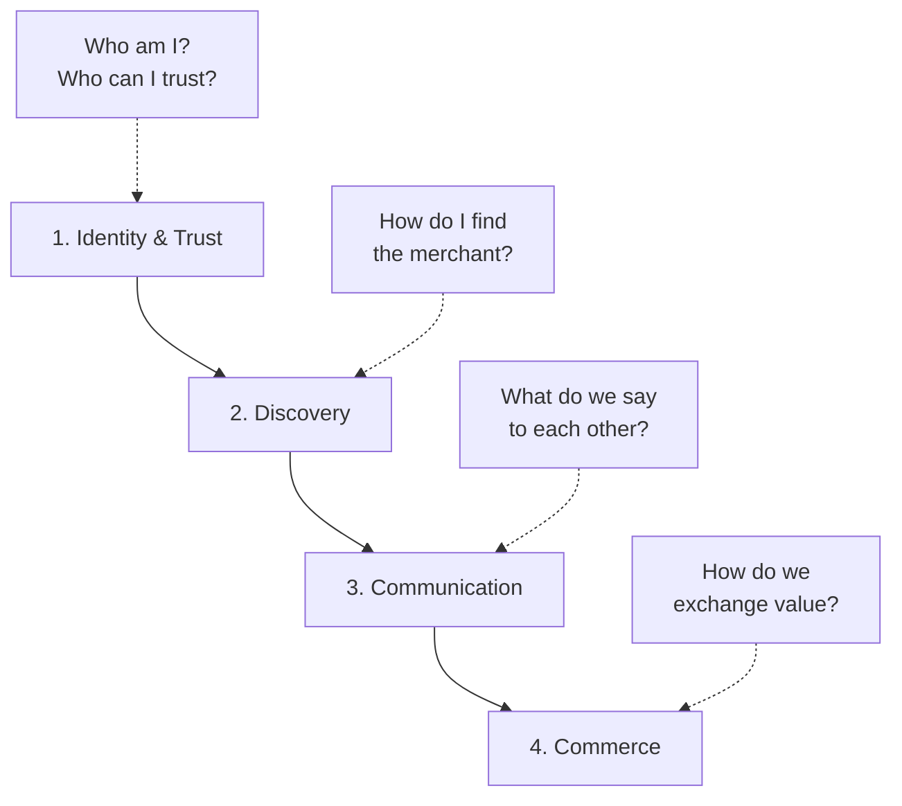

# The Broader Agentic Economy

Companion to the [main list](./README.md), which focuses tightly on **commerce** (ACP, UCP, AP2, payment rails, per-platform plugins). This file zooms out to the four-layer agentic-economy stack the commerce layer sits on top of.

If you got here looking for the previous `xpaysh/awesome-agentic-economy` repo, you're in the right place: it was renamed to `xpaysh/awesome-agentic-commerce` to reflect the focus, and this file preserves the broader framing. The old GitHub URL auto-redirects.

---

## The four-layer stack

An autonomous agent that buys something has to clear four questions, in order:

Every protocol in this list lives in exactly one of those layers. The main README catalogs **layer 4**; the other three are summarized below for context.

---

## Layer 1: Identity and trust ("the passport")

How agents prove who they are and decide who to trust.

| Protocol | What it is | Status |
|---|---|---|
| **Google AP2 Mandates** | Verifiable Credentials for agent authorization, audit trail | production |
| **Visa TAP** (Trusted Agent Protocol) | Agent verification + x402 bridge | new 2025 |
| **W3C DIDs / VCs** | Decentralized identity foundation | open standard |
| **Mastercard Know-Your-Agent** | TradFi-to-agent identity bridge, card-network integration | pilot |
| **Salesforce Agent Cloud** | Enterprise agent identity, CRM-integrated | new 2025 |
| **Forter TACP** | Agent-trust signal envelope (JWS + JWE) over any commerce flow | production |

Long form: [`protocols/identity-trust.md`](./protocols/identity-trust.md).

---

## Layer 2: Discovery ("the yellow pages")

How agents find merchants and services.

| Standard | What it is | Status |
|---|---|---|
| **A2A agent-card** (`/.well-known/agent-card.json`) | JSON manifest for agent capabilities, IANA-registered 2025-08-01 | production |
| **UCP business profile** (`/.well-known/ucp`) | Capability-negotiation entry point fetched by Google, Shopify, Etsy, Walmart, others | draft (active deployments) |
| **`/llms.txt`** | Markdown LLM-readable site map | de-facto standard |
| **schema.org JSON-LD** | `Product`, `Offer`, `AggregateOffer`, `BreadcrumbList` | open standard |
| **Olas (Autonolas)** | On-chain agent registries via NFTs | production |
| **IBM ACP Registry** | Agent capability registries, enterprise focus | beta |
| **[Hashgraph Online (HOL)](https://hashgraphonline.com)** | Universal agentic registry on Hedera: HCS-14 UAIDs, ERC-8004 bridge | production |

Long form: [`protocols/discovery.md`](./protocols/discovery.md).

The full list of well-known URIs to **emit and not emit** is in the main [README's Discovery standards section](./README.md#discovery-standards).

---

## Layer 3: Communication ("the language")

How agents and tools talk to each other.

| Protocol | What it is | Status |
|---|---|---|
| **A2A** (Google) | Agent-to-agent communication, real-time coordination | production |
| **MCP** (Anthropic) | Agent-to-tool communication, context sharing | production |
| **IBM ACP wire format** | Cross-framework agent communication, human-in-the-loop | beta |
| **[Summoner Network](https://github.com/Summoner-Network/summoner-agents)** | Agent-to-agent networking stack: long-lived TCP sessions, server-decoupled agents, nonce-chain handshake tracing. Python SDK + Rust relay. | production |

Long form: [`protocols/communication.md`](./protocols/communication.md).

### Agent-to-agent platforms and marketplaces

- **[Pinchwork](https://pinchwork.dev)** — open-source agent-to-agent task marketplace ([anneschuth/pinchwork](https://github.com/anneschuth/pinchwork)). A2A (JSON-RPC 2.0) + MCP + REST. Zero platform fees, credit-based escrow, task matching, delivery verification. Integrations: LangChain, CrewAI, PraisonAI, AutoGPT, n8n. MIT.

Note on naming: "ACP" is overloaded. **Agentic Commerce Protocol** (OpenAI + Stripe + Meta, layer 4) and **IBM's Agent Communication Protocol** (layer 3) are distinct projects sharing the acronym. This list reserves "ACP" without qualifier for the commerce protocol; the IBM project is referred to as "IBM ACP."

---

## Layer 4: Commerce ("the transaction")

This is the main list. See [`README.md`](./README.md) and [`protocols/commerce.md`](./protocols/commerce.md).

The active protocols (ACP, UCP, AP2, TACP), the payment rails beneath (MPP, x402, cards, stablecoins), the per-platform plugins on top.

### Adjacent and meta-payment protocols

These sit alongside or compose multiple rails. Not first-party commerce protocols by themselves, but worth tracking.

- **[MoltsPay Universal Payment Protocol (UPP)](https://moltspay.com)** by Zen7 — multi-chain abstraction layer that routes per chain: x402 / EIP-3009 (Base, Polygon), MPP (Tempo), Pay-for-Success (Solana), pre-approval (BNB). 8 chains, gasless via client-side signatures + facilitator execution. Node.js + Python SDKs. Service discovery built in.

---

## Why we narrowed to commerce

Builders land on this repo overwhelmingly for the commerce layer. Identity, discovery, and communication are well-surveyed elsewhere (W3C, IANA, the MCP and A2A communities). Commerce is where the depth lives in the main list.
